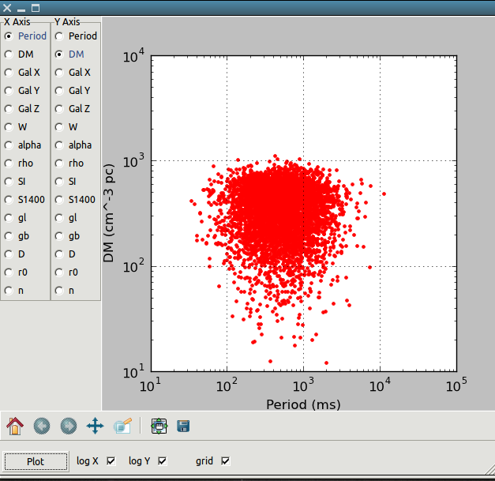

.. _tutorial-basic:

**********************
Tutorial - Basic Usage
**********************

This page will outline a very simple pipeline for basic population
simulations with PsrPopPy.

.. _generate_population:

Generate Population Model
=========================
Population models are generated using the ``populate`` script (installed
automatically with pip). A common use would be to generate a population of
normal pulsars using the Parkes Multibeam Pulsar Survey as a basis. This
survey detected 1038 pulsars (at last count). Using default radial distribution,
period and luminosity models, we can generate such a population using the command::

  populate -n 1038 -surveys PMSURV

This will then run for a few minutes, until the model PMSURV survey
has detected 1038 pulsars. The file ``populate.model`` will be produced
by default, which is a `pickled <http://docs.python.org/library/pickle.html>`_
population object.

.. _evolve_population:

Evolve a Population Model
=========================
The ``evolve`` script takes a snapshot-style population model and evolves
it according to the Ridley & Lorimer pulsar evolution method. This is
useful when you want to generate a more realistic, age-dependent
population before passing it on to a survey simulation.

A basic usage example is::

  evolve -n 1000 -surveys PMSURV -dm ne2025 -o evolve.model

This command will generate an evolved population of pulsars
using the NE2025 electron density model. The output file
``evolve.model`` can then be used by ``dosurvey`` or visualised with
``view.py``.

The evolve script also supports the same survey and population controls as
``populate``, including pulse width, beaming, spin-down, and electron
model options. For example, to use a fixed 5% pulse width and the WJ08
alignment model, run::

  evolve -n 1000 -surveys PMSURV -w 5.0 -alignmodel wj08 -o evolve.model

If you only want to generate the evolved population without checking a
survey, omit the ``-surveys`` option and use the output file directly:

  evolve -n 1000 -dm ne2025 -o evolve.model

.. _simulate_survey:

Simulate a Pulsar Survey
========================
Once you've generated a pulsar population model, the ``dosurvey`` script
can be used to run the model through a past, present or future, pulsar
survey (as specified in files in the ``survey`` directory --- see
:ref:`_model-survey-files`).

For example, say we want to take the population model we just created,
``pop_ne2025.model``, and estimate from this how many pulsars would be detected
in a putative LOFAR pulsar survey. This can be simply done using::

  dosurvey -f pop_ne2025.model -surveys LOFAR

.. _visualise_model:

Visualising a Pulsar Model
==========================
There are two ways to visualise the populations generated by either 
``populate.py`` (``.model``) or ``dosurvey.py`` (``.results``). To plot
basic histograms of various parameters, use the ``view.py`` script::
  
  python view.py -f <model> -p <parameter>

Here ``<parameter>`` could be ``period``, ``dm``, or several other options,
as outlined in :ref:`_view_doc`. Assuming the `Matplotlib <http://matplotlib.org/>`_ 
package is installed, this will generate a histogram which can then be
saved or printed as necessary.

To create a histogram of the logarithm of the selected parameter, use::
  
  python view.py -f <model> -p <parameter> --logx

If you have the wxPython plugin working (seems on newer macs this is a non-trivial
piece of software to install --- using macports is recommended) then use ``wxView.py``
to create scatter plots of various parameters (see screenshot below).

